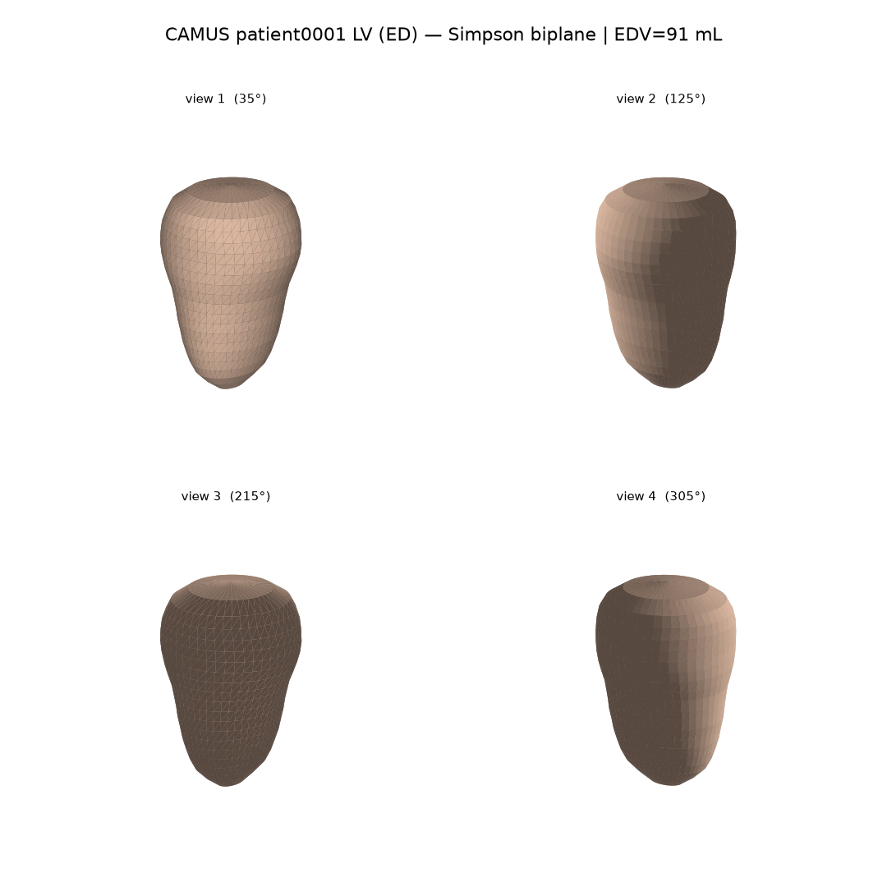
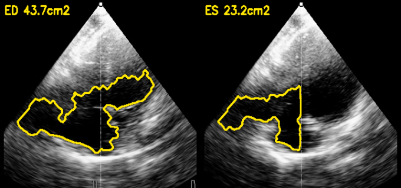
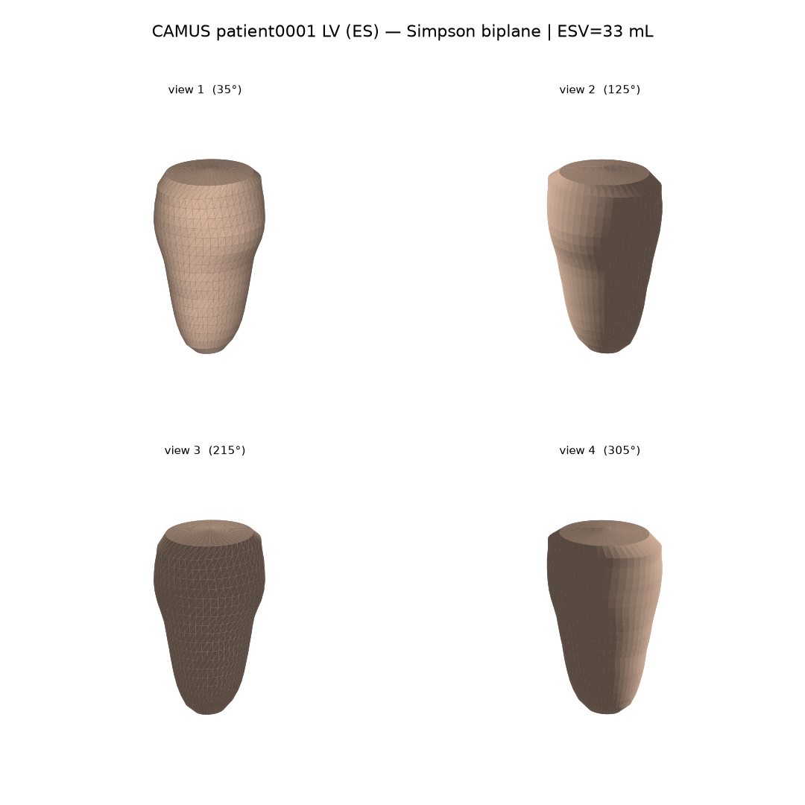
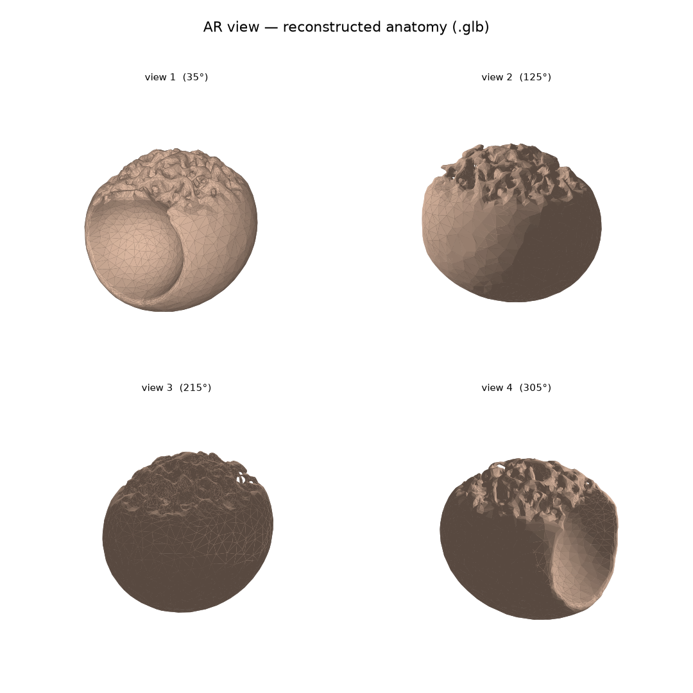

<div align="center">

# 🫀 SonoXR

### Hold a patient's beating heart — reconstructed from an ordinary 2D ultrasound — in mixed reality on a Meta Quest 3.

**And it's calibrated to tell you exactly what it _can't_ see.**

[](https://sonoxr-frontend.vercel.app)
&nbsp;
[](#-the-quest-3-client)
&nbsp;
[](LICENSE)

<br/>



<sub><b>Real output.</b> A left ventricle reconstructed from the 2-chamber + 4-chamber apical echo of CAMUS <code>patient0001</code> using Simpson's biplane method — honest 3D from real clinical geometry, <b>not</b> a fabricated depth axis.</sub>

</div>

---

## The one-line pitch

A cardiac echo is a 2D slice of a 3D organ. Clinicians spend years learning to rebuild that volume **in their heads**. SonoXR does the rebuild for them — turning the apical views of a standard echo study into a **living 3D left ventricle you can grab, rotate, and walk around** in mixed reality — and then layers on a voice agent that explains the anatomy in plain language **while explicitly flagging the regions it isn't confident about.**

> Most medical AI demos hide their failure modes to look impressive. **SonoXR does the opposite.** The mesh you hold carries the model's own doubt as a per-vertex confidence value, the heatmap *is* that doubt made visible, and the narration agent refuses to talk past what the data supports. **Trust is the feature.**

---

## ✨ What makes it different — calibrated honesty

This is the thesis of the whole project. Three commitments, enforced in code:

| Principle | How it shows up | Where it lives |
|---|---|---|
| **The model admits what it can't see.** | Per-region confidence is computed at segmentation and carried end-to-end to the mesh. Low-signal zones are rendered as a translucent red region you can literally see floating inside the heart. | `app/segmentation.py` → `app/narration.py` → Quest shader |
| **The narration never over-commits.** | When image quality is poor, the agent *widens* its uncertainty instead of inventing a crisp number. It is forbidden from inventing measurements or giving a diagnosis. | system prompts in `frontend/api/analyze.ts` & `app/narration.py` |
| **A placeholder never masquerades as a scan.** | If the input is the synthetic phantom, that fact is passed to the model and surfaced in the narration so no one mistakes it for real anatomy. | `app/narration.py` |

---

## 🎬 See it

| | |
|---|---|
| 🌐 **Live landing + patient viewer** | **[sonoxr-frontend.vercel.app](https://sonoxr-frontend.vercel.app)** |
| 📝 **Technical write-up** | [`/writeup`](https://sonoxr-frontend.vercel.app/writeup) on the live site |
| 🥽 **Quest 3 immersive scene** | open the viewer on a connected headset (falls back to WebXR on the web) |
| 🛰️ **Ask it on ASI:One** | the SonoXR chat agent is live on **Agentverse** (`ASI Available`) — ask it a patient's ejection fraction in plain English |

---

## 🖼️ Gallery — all real pipeline output

<div align="center">

**1 · Segment the LV cavity from the raw B-mode echo** — at end-diastole and end-systole.



**2 · Reconstruct the volume** — stack elliptical short-axis discs along the LV long axis (method of discs).

| End-diastole (EDV ≈ 91 mL) | End-systole |
|:--:|:--:|
|  |  |

**3 · Mesh it for AR** — Taubin-smoothed, decimated to a mobile-friendly `.glb` you can hold on the Quest 3.



</div>

---

## 🧠 The AI stack

SonoXR is wired to two inference services — **Claude** and **Deepgram** — plus a **Fetch.ai agent layer** that hosts the heavy compute and a plain-English Q&A interface (see [§ Fetch.ai agent layer](#-fetchai-agent-layer)). The two inference services follow the same rule: **degrade gracefully, never crash the demo.** If a key is missing, the feature falls back to grounded static text or the browser's built-in speech — the app keeps working and the status honestly reports `REAL_AI` vs `FALLBACK`.

### 🤖 Claude — the analysis & narration agent

Claude powers two distinct surfaces, and in both cases it is a **grounded** agent: it is given a structured JSON summary of *one* patient's reconstruction and is instructed to answer **only** from those numbers.

**1. The Patient Viewer analysis panel** (`frontend/api/analyze.ts`, model `claude-opus-4-8`)
A clinician asks a question — typed or spoken — about the reconstructed study. Claude answers in 2–4 sentences, in the voice of a careful echocardiographer, using only the supplied fields (EF, EDV, ESV, image quality, flagged uncertainty). Its system prompt hard-codes the honesty contract:

> *"Use ONLY the numbers and fields provided. Never invent measurements or anatomy. When the data flags low confidence or poor image quality, say so plainly and widen your uncertainty rather than over-committing to a crisp number. This is decision support for a research prototype — never give treatment instructions or a definitive diagnosis."*

The key is read **server-side only** by the Vercel function — it is never exposed to the browser. No key configured? The panel returns `{ configured: false }` and the client shows grounded fallback text.

**2. Backend AR narration** (`app/narration.py`, model `claude-sonnet-4-6`)
Stage 5 of the reconstruction pipeline. It turns the structured reconstruction summary into warm, plain-language AR-overlay commentary that **names what's visible, gives a sense of its size, and explicitly flags every low-confidence region** ("this area was harder to capture clearly — a re-scan here would give a sharper view"). No API key? It falls back to a deterministic templated narration so the demo never breaks.

### 🎙️ Deepgram — the voice loop

Deepgram closes the loop so a clinician can interact hands-free while a sterile field is in use or while wearing the headset.

| Direction | Model | Endpoint | Fallback |
|---|---|---|---|
| **Speech → text** (ask a question by voice) | Deepgram **Nova-2** (`smart_format`, `punctuate`) | `frontend/api/stt.ts` | mic affordance hidden until a key is set |
| **Text → speech** (hear Claude's answer aloud) | Deepgram **Aura-2** (`aura-2-thalia-en`) | `frontend/api/tts.ts` | browser Web Speech API |

The full voice round-trip: the browser's `MediaRecorder` captures the question → **Deepgram Nova-2** transcribes it → **Claude** answers it, grounded in the patient data → **Deepgram Aura-2** speaks the answer back. Like Claude, Deepgram keys are read server-side only.

### 🛰️ Fetch.ai — the agent layer

The expensive reconstruction compute and a plain-English Q&A interface live in two **Fetch.ai uAgents**: a data-provider agent that bakes the heart mesh, and an **ASI:One** chat agent that answers clinical questions about real reconstructed patients. This is the part that makes SonoXR's cardiac data discoverable and queryable by *any* agent on the network — see **[§ Fetch.ai agent layer](#-fetchai-agent-layer)** below.

---

## 🛠️ How it works — the reconstruction pipeline

A clean DAG: `main → pipeline → stage modules`. Each stage decides **PRIMARY vs FALLBACK** and writes a `status.json` that is the single source of truth for "which path ran" — exactly what you want when a judge asks how it works.

```
  2D apical echo (CAMUS)                            Meta Quest 3 / WebXR
  ┌───────────────────┐                            ┌────────────────────┐
  │  4CH  +  2CH       │                            │  hold · rotate ·   │
  │  ED   +  ES        │                            │  walk around the   │
  └─────────┬─────────┘                            │  beating LV  🫀     │
            │                                       └─────────▲──────────┘
            ▼                                                 │ .glb + narration.json
  ┌──────────────────────────────────────────────────────────┴───────────┐
  │  1 Ingestion        volumetric DICOM/NIfTI (primary) · video (fallback) │
  │  1.5 Preprocessing  ultrasound-aware speckle / contrast conditioning    │
  │  2 Segmentation     Otsu + 3D morphology + largest-CC  → CONFIDENCE map │
  │  3 Reconstruction   Simpson's biplane · method of discs (real geometry) │
  │  4 Meshing          Taubin smoothing + quadric decimation → mobile .glb │
  │  5 Narration  🤖     Claude: grounded, uncertainty-aware AR commentary   │
  └────────────────────────────────────────────────────────────────────────┘
```

**The headline algorithm — Simpson's biplane (`app/camus_biplane.py`):** from the expert LV-cavity masks of the apical 2-chamber and 4-chamber views, find the LV long axis (apex → mitral base midpoint), resample N short-axis levels along it, take the 4CH and 2CH diameters at each level, and stack **elliptical** discs (semi-axes D4/2, D2/2) into a smooth 3D surface. Because the geometry is real clinical geometry, the result is recognizable anatomy — not a blob with a made-up depth axis.

**Honest by omission, too** (`app/echo_cycle.py`): a clinically meaningful EF from raw B-mode pixels needs a trained segmentation model. Classical thresholding doesn't reliably trace the LV border, so this module **deliberately does not output an EF number** from raw pixels — it reports only what's defensible (real per-frame cardiac motion that genuinely pulses with the heartbeat).

---

## 🥽 The Quest 3 client

Native mixed-reality scene built in Unity for the Meta Quest 3 (`backend/unity/SonoXR_Quest3/`). The reconstructed `.glb` is loaded with GLTFast, dressed with a custom crimson/holographic shader, and the low-confidence region is shown as a translucent zone inside the mesh. Runs **on-device** — no streaming a patient's scan to the cloud just to look at it. On machines without a headset, the web Patient Viewer provides a **WebXR fallback** (three.js) so the experience degrades to a browser view instead of failing.

---

## 🛰️ Fetch.ai agent layer

**Heavy compute as a discoverable service.** SonoXR moves the expensive medical-imaging work **off the headset** and into two Fetch.ai uAgents. The Quest stays thin — it renders; the agents own the heavy, reusable, discoverable work.

**1 · Data-provider agent — owns the expensive I/O.**
Runs where the CAMUS dataset lives. When a patient is selected, it does the costly part: SimpleITK reads the volumetric scans, Simpson's biplane runs the reconstruction, and it bakes the GLB heart mesh. The Quest never touches raw medical I/O — it just renders what the agent produces.

**2 · ASI:One chat agent — makes the cardiac data queryable in plain English.**
Hosted on [Agentverse](https://agentverse.ai) (always-on, live right now with **`ASI Available`** status) and implementing `uagents_core`'s **Chat Protocol** with a published manifest, so ASI:One's LLM can route real queries to it. Anyone on ASI:One can ask *"what's patient0001's ejection fraction?"* and get back the LV ejection fraction, end-diastolic and end-systolic volumes, image quality, and the citation — all from real reconstructed patient data.

**Why this design (deliberate engineering judgment).**
The heart mesh still flows to the headset over plain **HTTP/GLB**, not a bespoke live socket — because the cost worth offloading is the medical-image I/O, not the rendering. So the agents own the part that's actually expensive, reusable, and discoverable. The payoff: the **same reconstruction that drives the AR heart is also a question-answering agent on ASI:One** — and the cardiac data becomes queryable by *any* agent on the network, not just this app.

> **The vision:** a network of these — each medical modality as a discoverable Fetch.ai agent, composable by ASI:One.

---

## 📁 Repository layout

| Path | What it is | Stack |
|------|-----------|-------|
| [`backend/`](backend/) | Ultrasound → `.glb` mesh + narration pipeline (FastAPI). Includes a static demo web frontend (`backend/frontend/`) and the Quest 3 Unity client source (`backend/unity/`). | Python · FastAPI · trimesh · scikit-image · **Claude** |
| [`frontend/`](frontend/) | Scroll-cinematic marketing landing page + Patient Viewer with the AI panel and voice loop. | React · TypeScript · Vite · three.js · **Claude** · **Deepgram** |
| [`frontend/api/`](frontend/api/) | Vercel serverless functions: `analyze.ts` (Claude), `stt.ts` / `tts.ts` (Deepgram). Keys read server-side only. | Vercel Functions |

---

## 🚀 Quick start

### Backend — reconstruction + narration API

```bash
cd backend
python -m venv .venv && source .venv/bin/activate   # Windows: .venv\Scripts\activate
pip install -r requirements.txt
cp .env.example .env          # add ANTHROPIC_API_KEY (optional — falls back to templated narration)
uvicorn app.main:app --reload
```

The golden demo path (`POST /demo`) runs the full pipeline on curated, pre-verified input and always produces recognizable anatomy. See [`backend/DEMO_RUNBOOK.md`](backend/DEMO_RUNBOOK.md).

> The large CAMUS imaging **dataset is not committed** (license + size). Re-fetch it with `backend/scripts/download_sample_data.py`. The small frozen demo artifacts needed for `/demo` and the AR pages **are** included.

### Frontend — web landing + Patient Viewer

```bash
cd frontend
npm install
npm run dev        # http://localhost:5173
```

API keys for the AI panel and voice loop are read **server-side only** by the Vercel functions in `frontend/api/` — see [`frontend/.env.example`](frontend/.env.example):

```bash
ANTHROPIC_API_KEY=...   # Claude analysis panel
DEEPGRAM_API_KEY=...     # Deepgram STT (Nova-2) + TTS (Aura-2)
```

### Unity AR client — Quest 3

Open `backend/unity/SonoXR_Quest3/` in Unity. Only the project **source** (`Assets/`, `ProjectSettings/`, `Packages/`) is committed — Unity regenerates `Library/` on first open. Copy your keys into `Assets/StreamingAssets/sonoxr_config.json` (a placeholder template is committed; the real file is git-ignored):

```json
{ "anthropic_api_key": "...", "deepgram_api_key": "..." }
```

---

## 🧰 Tech stack

**Reconstruction** — Python · FastAPI · NumPy · scikit-image (marching cubes) · trimesh + Taubin smoothing + quadric decimation · Simpson's biplane / method of discs
**Web** — React · TypeScript · Vite · three.js / WebXR · Vercel serverless functions
**XR** — Unity · Meta XR Interaction SDK · GLTFast · Quest 3 (Android build)
**AI** — **Claude** (`claude-opus-4-8` analysis · `claude-sonnet-4-6` narration) · **Deepgram** (Nova-2 STT · Aura-2 TTS)
**Agents** — **Fetch.ai** uAgents (`uagents_core` Chat Protocol) · hosted on **Agentverse** · discoverable via **ASI:One**
**Data** — CAMUS apical echo dataset (2CH/4CH, ED/ES, expert LV masks)

---

## ⚖️ Honest limitations

In keeping with the whole point of this project:

- **Research prototype, not a medical device.** Output is decision-support visualization, never diagnosis or treatment guidance.
- Reconstruction quality depends on the input echo quality; poor acoustic windows produce wider uncertainty, and the app says so rather than hiding it.
- EF/volume figures shown in the demo come from the curated CAMUS geometry; the system intentionally **won't** fabricate an EF from raw B-mode pixels (see `app/echo_cycle.py`).

---

## 🗺️ Sponsor tracks & roadmap

- **Voice (Deepgram)** — ✅ shipped: Nova-2 STT + Aura-2 TTS, the only voice integration that fit the architecture without distorting it.
- **Claude** — ✅ shipped: grounded, uncertainty-aware analysis + AR narration.
- **Agents (Fetch.ai / ASI:One)** — ✅ shipped: two uAgents — a data-provider that runs the reconstruction and an ASI:One chat agent (Chat Protocol, hosted on Agentverse) that answers clinical questions about real reconstructed patients. See **[§ Fetch.ai agent layer](#-fetchai-agent-layer)**.
- **Medical-education pivot** — 🔭 strongest repositioning: echo-interpretation training with **calibration-as-pedagogy**, occupying the uncontested intersection between SonoSim, Butterfly ScanLab, CAE Vimedix, and HeartWorks.

---

## 🔐 Security note

No live API keys are committed. All key material lives in git-ignored `.env` / `sonoxr_config.json` files; `.env.example` and `sonoxr_config.example.json` templates show the expected variables. Frontend AI keys are read **server-side only** by the Vercel functions — never shipped to the browser.

---

<div align="center">

**SonoXR** — CAMUS dataset · Calibrated-honesty layer · Voice by Deepgram · Analysis by Claude · Agents on Fetch.ai / ASI:One

Built for a hackathon. Built to tell you the truth.

📄 [MIT License](LICENSE)

</div>
